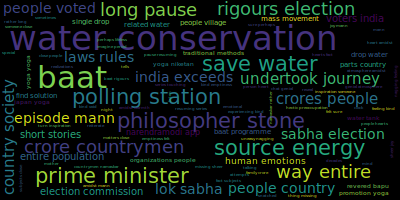
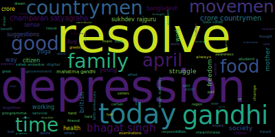
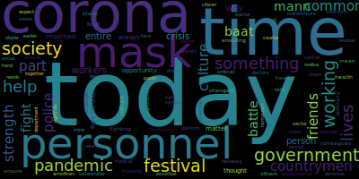
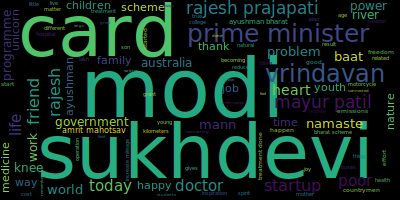
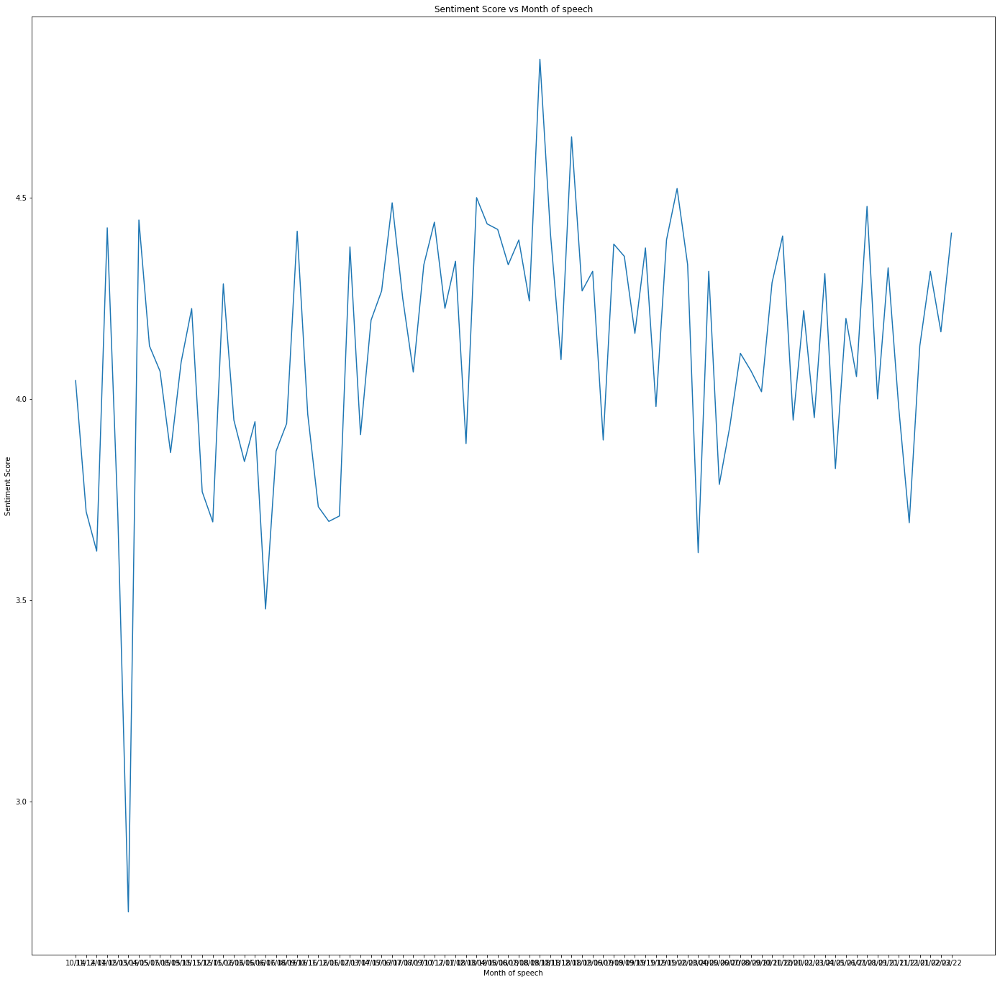

# Hons_S6

The initial question decided upon for the entirety of the project was to identify and explore primary sources of information to see how right wing political parties have used the Babri Masjid however, the scope of this question was too large to be finished as an honours project in a single semester and as such, the question was alternated to find the contexts implied in the usage of this topic in primary sources i.e. what was implied when the Babri Masjid or the Ayodhya Ram temple was brought up in a right wing poitician’s speech or a party publication.

## Initial Methodology

For the initial part of this project, pamphlets published and circulated directly by right wing parties were considered to be the database. For this purpose, 1486 images were scraped, all published by the Akhila Bharatha Vidyarthi Parishat, the student wing of BJP from JNU over the years from 1999 and 2014 and initial analyses were run. However, on running Optical Character Recognition softwares on the scraped images of the pamphlets (Tesseract was used in this case) the occurence of the required keywords (eg: Babri Masjid, Ayodhya Ram Temple, Hindu Rashtra) were too low to condsider this a valid database and no inferences could be drawn. Another issue faced during the implementation of this methodology was the unkempt archiving of pamphlets in most political parties. The pamphlets belonging to ABVP were obtained because they were stored in OCR recognizable forms by ‘The PaRCha project’, a movement local to JNU that attempts to add all pamphlets distributed within the university to a common database.

## Speeches

As the earlier database under consideration did not serve the requirements, attention was redirected to speeches made by the following BJP leaders:

- Narendra Modi
- Amit Shah
- Rajnath SIngh
- L K Advani
- Ravi Shankar Prasad
- Prakash Javadekar
- Atal Bihari Vajpayee
- Murali Manohar Joshi
- Yogi Aadityanath

These leaders were chosen due to one of two reasons, either they were major forces within the BJP during the time period when the demolition of the Babri Masjid occured or are influential power figures within the party at present. Various archives were looked into to find documented speeches of these persons, examples being:

- https://www.narendramodi.in/category/text-speeches
- https://www.bjp.org/speeches

However, most of the sites looked into were poorly managed, with very inconsistent updates and a lack of usefulness in its archives. Very few contained non-negligible amounts of relevant information such as the second link mentioned above but did not allow for scraping.

## Analysis on Mann ki Baat

As a starting point to the analysis on speeches, it was suggested by Prof. Radhika Krishnan to analyse ‘Mann ki baat’, the monthly program on All India Radio where the prime minister, Narendra Modi speaks on various topics concerning the Indian nation’s welfare. The speeches were succesfully scraped and as part of the initial analysis, a wordcloud of all the speeches combined was formed:

Wordclouds for individual speeches have also been completed and further tools such as topic modelling with the topics being evaluated yearly are in progress. Mann ki baat was presented as a direct means of communication from the Prime minister to the general public via All India Radio at regular intervals (as stated in the first speech of this series made on 3rd October 2014). However, the validity of these sppeches with reference to the content they would discuss was never ascertained and the value they provide solely in terms of information provided to the public from a primary source (the Prime Minister) regarding various issues of national importance is under suspicion. As such, three time periods were chosen, each 5 months long covering three major events that received global attention and computationally analysed the contents of the five speeches from the Mann ki Baat series made during these time periods.

#### Demonetisation

The wordcloud obtained is as follows:

#### CAA - NRC

The wordcloud obtained is as follows:

#### Farmers' Protest

The wordcloud obtained is as follows:

It should be noted that the words india and country were removed consciously from all wordclouds as their presences were too dominating in order to observe what the actual content of these speeches were. 
It can be observed that there is no mention of any of these three evnets throughout these issues as they were at their peak. This combined with the earlier mentioned requirement of removing certain words to otain a clear picture of the content of the speeches brings the actual intended function of this series of speeches into question. The major question here is why the prime Minister avoided talking about these sensitive topics in his speeches made to the general public of the country in all three instances when it was such a convenient vehicle to transmit his thoughts. An initial conclusion that can be reached here is that the Mann ki Baat series of speeches operates solely as a means to improve Modi’s public relations image, cementing him as a ruler who is close to his people while divulging very little to no information that is important. Simultaneouslu, the domineering presence of the words ‘india’, ‘country’ and his constant usage of familial terms such as ‘brother’ and ‘sister’ to refer to the general public can be interpreted to be an attempt at pushing the nationalistic ideals his political party has become famous for through various policies.

#### Sentiment Analysis

Read more about the tool here: https://towardsdatascience.com/sentiment-analysis-concept-analysis-and-applications-6c94d6f58c17  

Sentiment analysis has been tried on the scraped set of speeches using BERT. A pre-trained model has been used for this purpose that provides a sentiment score between 1 and 5. Because the model operates in a way that can only compute sentiment scores for 512 characters at a time, each sppech has been divided into chunks of this size and the final score has been computed as the average of each individual score. Hence, there are float values as scores. The details regaring this particular model is elaborated at: https://huggingface.co/nlptown/bert-base-multilingual-uncased-sentiment  

###### Observations

All speeches can be objectively said to use a corpus that is 'positive'. The least score observed is a 2.72 recorded on March 2015 and considering that 3 is the average score, implying neutrality this score is closer to being neutral than negative. The average score for all speeches (given equal weightage irrespective of number of characters in each) is 4.119514202122193, which indicates that Modi tends to be overwhelmingly positive in his opinions on topics discussed. A graph plotted based on this looks as follows:

#### Named Entity Recognition

Read more about the tool here: https://nanonets.com/blog/named-entity-recognition-with-nltk-and-spacy/  

nltk has been used to implement NER. Individual txt files have been created to distinguish results for people, locations and organizations. However, as it is possible that the algorithm might confuse the same word as multiple of these categories based on context, an overall txt file containing absolute frequencies has also been created for comparisons later on.

###### Observations

- Modi_Index: The number of times Modi has said his own name as part of this series of 84 speeches is 196
- India_index: The number of times he has mentioned India as an absolute noun is 1462 times
- Various symbols that represent the nation to the general public such as Gandhi appear often in his speeches (in this case, 190 times)

## Work going on now

- To validate that the time periods mentioned above are accurate, scraping will be done for 2 national newspapers and the topics discussed will be compared.
- Proper textual analysis will be done on these chosen 15 speeches from three time periods to study how they are used to make the people assured in the government while there are unresolved issues wreaking hvoc in the background and the popularisation of nationalistic politics.
- Access to a complete database on Indian political speeches has been requested from Dr. Jean-Thomas Martelli and access to this wide amount of data would further improve the validity of this study as comparisons between addresses made by the Prime minister and other political leaders addressing solely these events can also be analysed.
